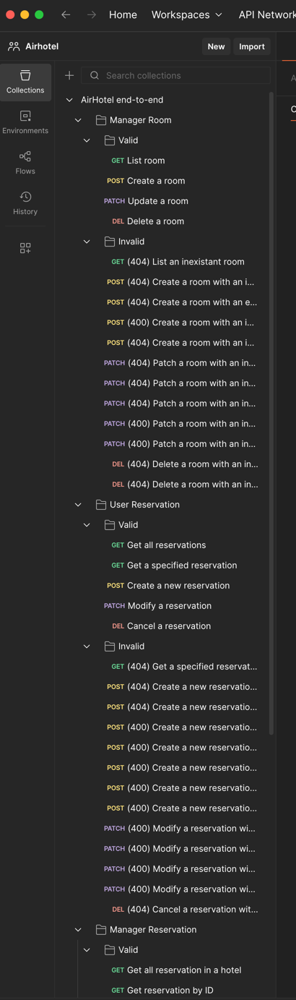

# Airhotel Application

## 1. Overview

Our team develops a Hotel Booking and Upgrade Management Service.  

This service provides an API for managing hotel room reservations from multiple sources, 
such as the hotel’s own website (e.g. Hilton.com, Marriott.com and Hyatt.com), 
OTA platforms (e.g. Expedia and Booking.com), and internal Property Management System.   

In addition, the service will perform useful computations to calculate priority for room upgrades for 
frequent travelers (All hotel groups like Hilton and Marriott have such a system), 
ensuring that high-value customers receive appropriate benefits.

**Functionality:**  

- Accept booking requests from multiple client systems and store them in a persistent datastore. 
- Manage cancellations, modifications, and room assignments. 
- Calculate upgrade priority for frequent travelers based on criteria such as membership tier, past booking history, spending level, and room availability. (beyond CRUD)
- Optimize room assignment when multiple high-tier customers compete for limited upgraded room types. (beyond CRUD)
- Adjust room rates dynamically based on factors such as seasonality, holidays, real-time occupancy, and booking trends, ensuring optimized revenue and competitive pricing. (beyond CRUD)
- Estimate overbooking risk for specific dates by analyzing historical cancellation and no-show rates, enabling hotels to balance occupancy maximization with guest satisfaction. (beyond CRUD)
- Log all API calls (reservations, cancellations, upgrade requests) with timestamp, client ID, and request details.


**Persistent Data:** 

- Hotel room inventory (room types, availability, pricing). 
- Customer profiles (basic info, membership tier, loyalty points). 
- Reservation records (status, dates, source of booking). 
- Upgrade history and allocation outcomes. 
- API access logs.

---

## 2. Instruction on Build and Run our application
Running in local machine:
- Install mvn package manager on machine.
- By-default this will give you java version 25.
- Configure JDK25 in the project structure.
- Use Intellij for easier maven project management.
- Run mvn clean install on terminal or using the Maven tool in Intellij.
- Set up a run configuration for Application.
- You need to download the .env file and set it to the environment variables for the cloud database and Google Auth.
    Download at: https://drive.google.com/file/d/1zYrPjETGtAKodVH8Y8lzHW-6dtofgcCF/view?usp=sharing
- Integration test with Postman by REST API endpoints.

**Following is our CI yaml file that we can see as an example on how to build & run the application:**
```yaml
name: Maven CI

on:
  push:
    branches: ["main"]
  pull_request:
    branches: ["main"]

jobs:
  build:
    runs-on: ubuntu-latest
    steps:
      - uses: actions/checkout@v4

      - name: Set up JDK
        uses: actions/setup-java@v3
        with:
          java-version: '25'
          distribution: 'temurin'

      - name: Build & Test
        working-directory: airhotel
        run: mvn -B clean verify

      - name: Generate Code Coverage
        working-directory: airhotel
        run: mvn jacoco:report

      - name: Upload Coverage Report
        uses: actions/upload-artifact@v4
        with:
          name: jacoco-report
          path: airhotel/target/site/jacoco

      - name: Run Checkstyle
        working-directory: airhotel
        run: mvn checkstyle:check

      - name: Run PMD
        working-directory: airhotel
        run: mvn pmd:check
```

**Note:** Client Program documentation setup is written inside `root/client_program` folder

---

## 3. API Endpoints

# Hotel Booking API

> **Auth**
> - **Public** endpoints do not require authentication.
> - **Private** endpoints require `Authorization: Bearer <token>`.

---

## Public

| Method | Path                 | Description                    |
| -----: | -------------------- | ------------------------------ | 
|    GET | `/hotels`            | List all hotels.               |
|    GET | `/hotels/{id}`       | Fetch hotel details.           |
|    GET | `/hotels/{id}/room-types` | List room types for that hotel (no pricing). |


### /auth
| Method | Path                         | Description                                |
|-------:|------------------------------|--------------------------------------------|
| GET    | `/auth/google/login`         | Redirect to Google OAuth.                  |
| GET    | `/auth/google/rollback`      | Google redirects here with `code`.         |
| GET    | `/auth/me`                   | Return current logged-in user info.        |

---

## Private

### /reservations
(Authenticated — current user context)

| Method | Path                 | Description                       | Sample Input                                                                                                                                                                                               | Sample Output                                                                                                                                                                                                                                                                      | Status Code                                                          |
| -----: | -------------------- | --------------------------------- | ---------------------------------------------------------------------------------------------------------------------------------------------------------------------------------------------------------- | ---------------------------------------------------------------------------------------------------------------------------------------------------------------------------------------------------------------------------------------------------------------------------------- | -------------------------------------------------------------------- |
|    GET | `/reservations`      | List current user’s reservations. | `GET /reservations`                                                                                                                                                                                        | `[{"id":17,"status":"CANCELED","upgradeStatus":"NOT_ELIGIBLE","checkInDate":"2025-11-01","checkOutDate":"2025-11-05","nights":4,"numGuests":2,"priceTotal":0.00,"hotelName":null,"roomTypeName":null,"createdAt":"2025-10-19T07:51:34Z"}]`                                         | `200` (OK); `400` (Bad Request); `500` (Internal Server Error)       |
|   POST | `/reservations`      | Create a reservation.             | `POST /reservations` Body: `{"hotelId":2,"roomTypeId":26,"checkInDate":"2025-12-21","checkOutDate":"2025-12-24","nights":4,"numGuests":2,"currency":"USD","priceTotal":399,"notes":"Late arrival ~23:00"}` | Same as Input                                                                                                                                                                                                                                                                      | `201` (Created); `404` (Not Found); `500` (Internal Server Error)    |
|    GET | `/reservations/{id}` | Fetch reservation details.        | `GET /reservations/22`                                                                                                                                                                                     | `{"id":22,"status":"CANCELED","upgradeStatus":"NOT_ELIGIBLE","checkInDate":"2025-12-21","checkOutDate":"2025-12-24","nights":3,"numGuests":1,"currency":"USD","priceTotal":799.00,"roomNumber":null,"createdAt":"2025-10-23T05:41:27Z","nightlyPrices":null,"statusHistory":null}` | `200` (OK); `404` (Not Found); `500` (Internal Server Error)         |
|  PATCH | `/reservations/{id}` | Modify reservation.               | `PATCH /reservations/22` Body: `{"checkInDate":"2025-12-21","checkOutDate":"2025-12-24","nights":2,"numGuests":1}`                                                                                         | `{"id":"res1","hotelId":"h1","roomId":"r101","from":"2025-11-01","to":"2025-11-04","guests":2,"status":"BOOKED"}`                                                                                                                                                                  | `200` (OK); `404` (Not Found); `500` (Internal Server Error)         |
| DELETE | `/reservations/{id}` | Cancel reservation.               | `DELETE /reservations/2`                                                                                                                                                                                   | *(empty body)*                                                                                                                                                                                                                                                                     | `204` (No Content); `404` (Not Found); `500` (Internal Server Error) |

### /hotels/{hotelId}/room-types/availability
| Method | Path | Description | Sample Input | Sample Output | Status Code |
| -----: | ---- | ----------- | ------------ | ------------- | ----------- |
| GET | `/hotels/{hotelId}/room-types/availability?checkIn=YYYY-MM-DD&checkOut=YYYY-MM-DD&numGuests=2` | Check availability and pricing for room types in a hotel (auth required) | Query params: `checkIn`, `checkOut`, optional `numGuests` | `[{"roomTypeId":35,"code":"RC-2BR-EXEC","name":"Two-Bedroom Executive Suite","bedType":"King","capacity":4,"totalRooms":4,"available":4,"baseRate":2200.00}, ...]` | `200` (OK); `400` (Bad Request); `403` (Forbidden if unauthenticated); `500` (Internal Server Error) |


---

## Manager (Private)

### /manager/hotels/{hotelId}/rooms
| Method | Path                                       | Description        | Sample Input                                                                                                               | Sample Output                                                                                                                                                             | Status Code                                                    |
| -----: | ------------------------------------------ | ------------------ | -------------------------------------------------------------------------------------------------------------------------- | ------------------------------------------------------------------------------------------------------------------------------------------------------------------------- | -------------------------------------------------------------- |
|    GET | `/manager/hotels/{hotelId}/rooms`          | List/filter rooms. | `GET /manager/hotels/h1/rooms`                                                                                             | `{"id":1540,"hotelId":2,"roomTypeId":1,"roomNumber":"AB-CDE-19","floor":1,"status":"AVAILABLE","createdAt":"2025-10-23T05:13:16","updatedAt":"2025-10-23T05:13:16"}, ...` | `200` (OK); `400` (Bad Request); `500` (Internal Server Error) |
|   POST | `/manager/hotels/{hotelId}/rooms`          | Create room.       | `POST /manager/hotels/h1/rooms` Body: `{"roomTypeId":"1","roomNumber":"AB-CDE-21","floor":"1","status":"AVAILABLE"}`       | Same as input                                                                                                                                                             | `200` (OK); `400` (Bad Request); `500` (Internal Server Error) |
| DELETE | `/manager/hotels/{hotelId}/rooms/{roomId}` | Delete room.       | `DELETE /manager/hotels/h1/rooms/r202`                                                                                     | *(empty body)*                                                                                                                                                            | `200` (OK); `404` (Not Found); `500` (Internal Server Error)   |
|  PATCH | `/manager/hotels/{hotelId}/rooms/{roomId}` | Update room.       | `PATCH /manager/hotels/h1/rooms/r202` Body: `{"roomTypeId":"1","roomNumber":"AB-CDE-22","floor":"1","status":"AVAILABLE"}` | Same as input                                                                                                                                                             | `200` (OK); `404` (Not Found); `500` (Internal Server Error)   |


### /manager/hotels/{hotelId}/reservations
| Method | Path                                                                   | Description                   | Sample Input                                                                                          | Sample Output                                                                                                                                                                                                                                                                                                                                                                                       | Status Code                                                    |
| -----: | ---------------------------------------------------------------------- | ----------------------------- | ----------------------------------------------------------------------------------------------------- | --------------------------------------------------------------------------------------------------------------------------------------------------------------------------------------------------------------------------------------------------------------------------------------------------------------------------------------------------------------------------------------------------- | -------------------------------------------------------------- |
|    GET | `/manager/hotels/{hotelId}/reservations`                               | List/filter all reservations. | `GET /manager/hotels/h1/reservations?status=booked&from=2025-11-01&to=2025-11-30`                     | `[{"id":1,"clientId":9,"userId":50,"hotelId":2,"roomTypeId":2,"roomId":449,"status":"CHECKED_OUT","checkInDate":"2026-01-05","checkOutDate":"2026-01-06","nights":1,"numGuests":3,"currency":"CNY","priceTotal":-1.00,"sourceReservationCode":"RC-SF-0001","upgradeStatus":"APPLIED","notes":"Hello","createdAt":"2025-10-13T22:10:42","upgradedAt":"2025-10-17T04:01:49","canceledAt":null}, ...]` | `200` (OK); `400` (Bad Request); `500` (Internal Server Error) |
|    GET | `/manager/hotels/{hotelId}/reservations/{reservationId}`               | View any guest’s reservation. | `GET /manager/hotels/h1/reservations/22`                                                              | `{"id":1,"clientId":9,"userId":50,"hotelId":2,"roomTypeId":2,"roomId":449,"status":"CHECKED_OUT","checkInDate":"2026-01-05","checkOutDate":"2026-01-06","nights":1,"numGuests":3,"currency":"CNY","priceTotal":-1.00,"sourceReservationCode":"RC-SF-0001","upgradeStatus":"APPLIED","notes":"Hello","createdAt":"2025-10-13T22:10:42","upgradedAt":"2025-10-17T04:01:49","canceledAt":null}`        | `200` (OK); `400` (Bad Request); `500` (Internal Server Error) |
|  PATCH | `/manager/hotels/{hotelId}/reservations/{reservationId}`               | Modify reservation.           | `PATCH /manager/hotels/h1/reservations/22` Body: `{"numGuests":1}`                                    | `{"id":1,"clientId":9,"userId":50,"hotelId":2,"roomTypeId":2,"roomId":449,"status":"CHECKED_OUT","checkInDate":"2026-01-05","checkOutDate":"2026-01-06","nights":1,"numGuests":1,"currency":"CNY","priceTotal":-1.00,"sourceReservationCode":"RC-SF-0001","upgradeStatus":"APPLIED","notes":"Hello","createdAt":"2025-10-13T22:10:42","upgradedAt":"2025-10-17T04:01:49","canceledAt":null}`        | `200` (OK); `400` (Bad Request); `500` (Internal Server Error) |
|  PATCH | `/manager/hotels/{hotelId}/reservations/{reservationId}:apply-upgrade` | Apply upgrade.                | `PATCH /manager/hotels/h1/reservations/22:apply-upgrade` Body: `{"toType":"suite","priceDelta":50.0}` | *(your response body here)*                                                                                                                                                                                                                                                                                                                                                                         | `200` (OK); `400` (Bad Request); `500` (Internal Server Error) |
|  PATCH | `/manager/hotels/{hotelId}/reservations/{reservationId}:check-in`      | Check in.                     | `PATCH /manager/hotels/h1/reservations/22:check-in`                                                   | `{"id":1,"clientId":9,"userId":50,"hotelId":2,"roomTypeId":2,"roomId":449,"status":"CHECKED_IN","checkInDate":"2026-01-05","checkOutDate":"2026-01-06","nights":1,"numGuests":3,"currency":"CNY","priceTotal":-1.00,"sourceReservationCode":"RC-SF-0001","upgradeStatus":"APPLIED","notes":"Hello","createdAt":"2025-10-13T22:10:42","upgradedAt":"2025-10-17T04:01:49","canceledAt":null}`         | `200` (OK); `400` (Bad Request); `500` (Internal Server Error) |
|  PATCH | `/manager/hotels/{hotelId}/reservations/{reservationId}:check-out`     | Check out.                    | `PATCH /manager/hotels/h1/reservations/22:check-out`                                                  | `{"id":1,"clientId":9,"userId":50,"hotelId":2,"roomTypeId":2,"roomId":449,"status":"CHECKED_OUT","checkInDate":"2026-01-05","checkOutDate":"2026-01-06","nights":1,"numGuests":3,"currency":"CNY","priceTotal":-1.00,"sourceReservationCode":"RC-SF-0001","upgradeStatus":"APPLIED","notes":"Hello","createdAt":"2025-10-13T22:10:42","upgradedAt":"2025-10-17T04:01:49","canceledAt":null}`        | `200` (OK); `400` (Bad Request); `500` (Internal Server Error) |
| DELETE | `/manager/hotels/{hotelId}/reservations/{reservationId}`               | Cancel reservation.           | `DELETE /manager/hotels/h1/reservations/22`                                                           | *(empty body)*                                                                                                                                                                                                                                                                                                                                                                                      | `200` (OK); `400` (Bad Request); `500` (Internal Server Error) |


---

## Admin

### /admin
| Method | Path                     | Description          |
|-------:|--------------------------|----------------------|
| POST   | `/admin/pricing/update`  | Trigger pricing update. |

---

## 4. Steps to test private API Endpoints

1. Go to (https://airhotelv1-364322827659.us-east4.run.app/login)
2. Sign in with your Google account
3. Open the develop console in your browser
4. Go to Application tab
5. Under Cookie, copy the value
6. In the header section of postman (or similar API testing tools), add a key (Cookie), and a value (JSESSIONID="The cookie value you got")
7. With the cookie in the header section, you now have access to private endpoints
8. Our test from postman: 

--- 

## 5. Static Code Analysis
`Google Checkstyle` to enforce coding standards and style rules.
- Included following dependency in our pom file:
  - ```
      <!-- Google Checkstyle -->
      <plugin>
        <groupId>org.apache.maven.plugins</groupId>
        <artifactId>maven-checkstyle-plugin</artifactId>
        <version>3.3.1</version>
        <configuration>
          <configLocation>google_checks.xml</configLocation>
          <!-- <configLocation>sun_checks.xml</configLocation> -->
          <includeTestSourceDirectory>true</includeTestSourceDirectory>
          <failsOnError>false</failsOnError>
        </configuration>
      </plugin>
    ```
- Then, two options for validation:
  - Validates *indentation, whitespace, naming conventions, Javadoc, etc.*
  - First, We can run mvn:mvn checkstyle locally in terminal and generate a xml report file inside *target/checkstyle-result.xml*.
  - Second, we have added a section in our *Github CI yaml file*. The Github action will fail if checkstyles do not pass.
    - Also, we have added a section for `PMD Analysis` checking for logic level programming issues such as *unused vars, dead code, bad practices and complexity*.
```yaml
  - name: Run Checkstyle
    working-directory: airhotel
    run: mvn checkstyle:check
  - name: Run PMD
    working-directory: airhotel
    run: mvn pmd:check
```

---
## 6. Project Agile/Kanban Board

Github Project Board:
https://github.com/users/ClevelandTuTu/projects/1

--- 

## 6. What developers need to know to create a client program for Airhotel service?

There are two target users of the Airhotel service: 
1. travelers; 
2. managers of the hotels.

If you are developing a platform for the travelers, here are the APIs you need to use:
1. Auth: `/oauth2/authorization/google` (login), `/logout`, `/auth/me`.
2. Browse hotels and room types: `GET /hotels`, `GET /hotels/{id}`, `GET /hotels/{id}/room-types`.
3. Check availability: `GET /hotels/{hotelId}/room-types/availability?checkIn=YYYY-MM-DD&checkOut=YYYY-MM-DD&numGuests=N`.
4. Manage own reservations: `GET /reservations`, `POST /reservations`, `GET /reservations/{id}`, `PATCH /reservations/{id}`, `DELETE /reservations/{id}`.

If you are developing a platform for the managers of the hotels, here are the APIs you need to use:
1. Auth: `/oauth2/authorization/google` (login), `/logout`, `/auth/me`.
2. Manage rooms: `GET /manager/hotels/{hotelId}/rooms`, `POST /manager/hotels/{hotelId}/rooms`, `PATCH /manager/hotels/{hotelId}/rooms/{roomId}`, `DELETE /manager/hotels/{hotelId}/rooms/{roomId}`.
3. Manage reservations: `GET /manager/hotels/{hotelId}/reservations`, `GET /manager/hotels/{hotelId}/reservations/{reservationId}`, `PATCH /manager/hotels/{hotelId}/reservations/{reservationId}`, `PATCH /manager/hotels/{hotelId}/reservations/{reservationId}:apply-upgrade`, `PATCH /manager/hotels/{hotelId}/reservations/{reservationId}:check-in`, `PATCH /manager/hotels/{hotelId}/reservations/{reservationId}:check-out`, `DELETE /manager/hotels/{hotelId}/reservations/{reservationId}`.

Details of all the APIs have been listed in previous sections.
